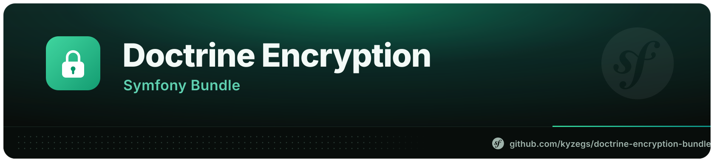

# Doctrine Encryption Bundle

Field-level authenticated encryption and blind indexes for Doctrine entities in Symfony applications.

Maintained fork published as `kyzegs/doctrine-encryption-bundle`, replacing the unmaintained original package.

## Requirements

- PHP 8.2 or newer
- Symfony 6.4, 7.4, or 8.x
- Doctrine ORM 2.20 or 3.x
- OpenSSL with AES-256-GCM support

## Installation

```bash
composer require kyzegs/doctrine-encryption-bundle
```

Register the bundle if Symfony Flex has not already done so:

```php
// config/bundles.php
return [
    Kyzegs\DoctrineEncryptionBundle\DoctrineEncryptionBundle::class => ['all' => true],
];
```

Generate a 256-bit key:

```bash
bin/console encrypt:genkey
```

Store the result in a secret manager or an uncommitted environment file:

```dotenv
DOCTRINE_ENCRYPTION_ENCRYPT_KEY=base64-encoded-key
```

Configure the bundle:

```yaml
# config/packages/doctrine_encryption.yaml
doctrine_encryption:
    encrypt_key: '%env(DOCTRINE_ENCRYPTION_ENCRYPT_KEY)%'
    key_id: '2026-01'
```

Never commit the key. [Blind indexes](#searching-encrypted-values) need a second key, which only applications
using that feature have to configure.

## Encrypting fields

Use the PHP attribute on a Doctrine string field. Allow room for the versioned ciphertext envelope; `TEXT` is the least surprising choice.

```php
use Doctrine\ORM\Mapping as ORM;
use Kyzegs\DoctrineEncryptionBundle\Attribute\Encrypted;

#[ORM\Column(type: 'text', nullable: true)]
#[Encrypted]
private ?string $personalNumber = null;
```

New values are written with AES-256-GCM in a versioned, authenticated envelope. The entity contains plaintext while it is in memory; Doctrine stores ciphertext. Existing unversioned AES-CBC and AES-GCM values from older bundle versions remain readable.

External XML, YAML, or PHP Doctrine mappings can opt in without modifying the entity:

```xml
<field name="personalNumber" type="text">
    <options>
        <option name="encrypted">true</option>
    </options>
</field>
```

The equivalent field option is `encrypted: true`.

### Encrypting JSON arrays

Doctrine `json` fields can encrypt array values without exposing serialization or ciphertext wrappers in entities. Select JSON format explicitly:

```php
#[ORM\Column(type: 'json', nullable: true)]
#[Encrypted(format: Encrypted::FORMAT_JSON)]
private ?array $metadata = null;
```

External XML, YAML, or PHP mappings use `encrypted: json` instead of `encrypted: true`:

```xml
<field name="metadata" type="json">
    <options>
        <option name="encrypted">json</option>
    </options>
</field>
```

Only arrays and `null` are accepted. Objects, resources, and scalar JSON values are rejected so hydration always preserves the declared array contract. Plaintext arrays already stored in a JSON column remain readable and are encrypted when changed or when processed by `encrypt:database encrypt`.

Encrypted JSON is stored as a versioned wrapper:

```json
{
  "__doctrine_encrypted": {
    "version": 1,
    "ciphertext": "versioned-ciphertext-envelope<ENC>"
  }
}
```

Wrapper detection requires exactly these keys, supported version `1`, and the `<ENC>` ciphertext marker. Other arrays containing `__doctrine_encrypted` remain plaintext. The exact wrapper shape is reserved and must not be used as application data.

Encrypted scalar properties inside Doctrine embeddables are supported. Mark the embeddable property normally; bundle uses Doctrine's nested field path for encryption, decryption, change tracking, and database maintenance:

```php
#[ORM\Embeddable]
final class ContactDetails
{
    #[ORM\Column(type: 'text')]
    #[Encrypted]
    public string $privateNote;
}
```

## Searching encrypted values

Randomized encryption cannot be queried by plaintext and must not carry a meaningful unique constraint. Add a blind-index column instead.

Blind indexes are hashed with their own key, which must differ from `encrypt_key`. Configure it before mapping
the first blind index; without it, writing one fails with a message saying so.

```dotenv
DOCTRINE_ENCRYPTION_BLIND_INDEX_KEY=a-different-secret
```

```yaml
doctrine_encryption:
    blind_index_key: '%env(DOCTRINE_ENCRYPTION_BLIND_INDEX_KEY)%'
```

```php
use Kyzegs\DoctrineEncryptionBundle\Attribute\BlindIndex;
use Kyzegs\DoctrineEncryptionBundle\Attribute\Encrypted;

#[ORM\Column(type: 'text')]
#[Encrypted]
private string $email;

#[ORM\Column(type: 'string', length: 64, unique: true, nullable: true)]
#[BlindIndex(sourceField: 'email', normalizer: BlindIndex::NORMALIZE_LOWERCASE)]
private ?string $emailLookupHash = null;
```

Query through `BlindIndexQueryHelper`, which reads the normalizer from the mapping:

```php
use Kyzegs\DoctrineEncryptionBundle\BlindIndex\BlindIndexQueryHelper;

// Name the encrypted field being searched; the helper returns criteria for its blind index.
$criteria = $blindIndexQueryHelper->criteria(User::class, 'email', $email);
$user = $repository->findOneBy($criteria);
```

For a query builder, hash a single blind-index field directly:

```php
$hash = $blindIndexQueryHelper->hash(User::class, 'emailLookupHash', $email);

$qb->andWhere('u.emailLookupHash = :hash')->setParameter('hash', $hash);
```

Both throw when the named field is not a blind index, so a renamed or removed index fails loudly instead of
returning no rows. Hashing by hand with `BlindIndexHasherInterface` still works, but the normalizer passed at
the call site has to keep matching the attribute; when the two drift, the query silently finds nothing.

Available normalizers are `none`, `trim`, `lowercase`, and `uppercase`. Blind indexes reveal equality patterns; use them only for fields that genuinely need lookups.

Rebuild indexes in bounded batches:

```bash
bin/console encrypt:blind-index --batch-size=500 --dry-run
bin/console encrypt:blind-index --batch-size=500
```

## Key rotation

Change the current key and key ID, then retain old keys under `decryption_keys`:

```yaml
doctrine_encryption:
    encrypt_key: '%env(DOCTRINE_ENCRYPTION_ENCRYPT_KEY_2026)%'
    key_id: '2026'
    decryption_keys:
        '2025': '%env(DOCTRINE_ENCRYPTION_ENCRYPT_KEY_2025)%'
```

Back up the database, inspect the operation, and rotate in batches:

```bash
bin/console encrypt:database rotate --dry-run
bin/console encrypt:database rotate --batch-size=250
```

Remove a retired key only after every value using its key ID has been rotated and verified.

### Reading legacy AES-CBC values

Unauthenticated AES-CBC ciphertext is refused by default, because accepting it lets anyone who can write to
the database strip authentication from a value. Opt in only for the length of the migration:

```yaml
doctrine_encryption:
    allow_legacy_cbc: true
```

Rotate every affected table with `encrypt:database rotate`, then remove the setting.

### Renaming an encrypted field

A ciphertext records the field it was written to and, by default, may only be read back from that field.
Renaming a mapped field therefore needs one of two migrations: rotate the affected table straight after the
rename, or relax verification while the old values are still in place.

```yaml
doctrine_encryption:
    verify_associated_data: false
```

Rotate, then restore the default. Leaving verification off allows a ciphertext to be moved between columns
by anyone who can write to the database.

## Database maintenance

The maintenance command supports scalar and encrypted JSON fields with `encrypt`, `decrypt`, and `rotate`, custom and composite scalar identifiers, quoted identifiers, transactions, batches, confirmation, and dry runs:

```bash
bin/console encrypt:database encrypt --dry-run
bin/console encrypt:database decrypt --manager=tenant --batch-size=100
```

Association identifiers are rejected because they cannot be updated safely by the low-level command. Always take a verified backup before a write operation.

## Multiple Doctrine connections

```yaml
doctrine_encryption:
    encrypt_key: '%env(DOCTRINE_ENCRYPTION_ENCRYPT_KEY)%'
    connections: ['default', 'tenant']
```

## Optional Twig filter

Install Twig and leave `enable_twig` enabled to expose `value|decrypt`:

```bash
composer require symfony/twig-bundle
```

Decrypting in templates increases the number of places where plaintext exists. Prefer decrypting only at the application boundary that needs it.

## Custom integrations

`KeyProviderInterface` is the extension point for Vault, KMS, HSM, or another secret source. It returns binary 32-byte keys and supports lookup by ciphertext key ID. Register the implementation as a service and configure it directly:

```yaml
doctrine_encryption:
    key_provider_service: 'App\\Encryption\\KmsKeyProvider'
    blind_index_key: '%env(DOCTRINE_ENCRYPTION_BLIND_INDEX_KEY)%'
```

Likewise, `encryptor_service` accepts any registered `EncryptorInterface` service with arbitrary injected dependencies. `encryptor_class` remains available as a deprecated compatibility path for classes using the historical event-dispatcher constructor.

## Security notes

- Encryption does not replace access control, TLS, backups, audit logging, or database hardening.
- Losing an encryption key permanently loses the corresponding data.
- Application compromise can expose plaintext and keys while the process is running.
- Blind indexes permit equality analysis and require their own high-entropy secret, distinct from the
  encryption key.
- `is_disabled: true` turns the bundle off completely: encrypted fields are neither encrypted on write nor
  decrypted on read, so entities hold whatever the column holds.
- Test restoration and rotation on a copy of production data before operating on production.

See [UPGRADE.md](UPGRADE.md) before upgrading an existing installation and [SECURITY.md](SECURITY.md) for vulnerability reporting.
